<div align="center">

# P-UWDM

### Physics-Guided Conditional Pixel-Space Diffusion for Underwater Image Enhancement

*A Swin-UNet diffusion denoiser conditioned on learned ambient-light and transmission priors, degradation severity, and a physics-gated red-channel compensation module.*


**B.Sc. Thesis · Department of Computer Science and Engineering · University of Rajshahi, Bangladesh**

</div>

<p align="center">
  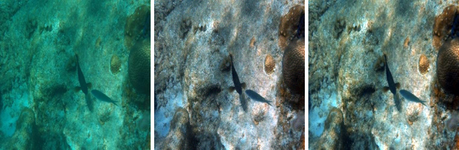
  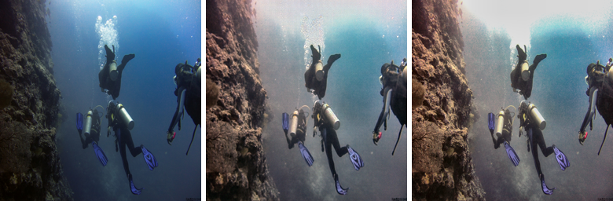
  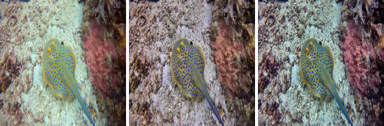
</p>
<p align="center"><sub>Left → right in every panel: degraded input · P-UWDM output · UIEB reference. Three of the eight highest-scoring test images.</sub></p>

---

## Table of Contents

- [P-UWDM](#p-uwdm)
    - [Physics-Guided Conditional Pixel-Space Diffusion for Underwater Image Enhancement](#physics-guided-conditional-pixel-space-diffusion-for-underwater-image-enhancement)
  - [Table of Contents](#table-of-contents)
  - [1. Overview](#1-overview)
    - [Key ideas](#key-ideas)
    - [Headline result (UIEB test split, 134 images, 256×256)](#headline-result-uieb-test-split-134-images-256256)
  - [2. Background: the physics of underwater degradation](#2-background-the-physics-of-underwater-degradation)
  - [3. Method](#3-method)
    - [3.1 End-to-end pipeline](#31-end-to-end-pipeline)
    - [3.2 Physics priors](#32-physics-priors)
    - [3.3 Learned conditioning networks (A-Net \& T-Net)](#33-learned-conditioning-networks-a-net--t-net)
    - [3.4 Swin-UNet denoiser with MDWA and AdaGN](#34-swin-unet-denoiser-with-mdwa-and-adagn)
    - [3.5 Red Channel Compensation (RCC)](#35-red-channel-compensation-rcc)
    - [3.6 Diffusion process and DDIM sampling](#36-diffusion-process-and-ddim-sampling)
  - [4. Training](#4-training)
    - [4.1 Objective](#41-objective)
    - [4.2 Why the image-space losses are gated](#42-why-the-image-space-losses-are-gated)
    - [4.3 Training recipe](#43-training-recipe)
  - [5. Data and evaluation protocol](#5-data-and-evaluation-protocol)
  - [6. Results](#6-results)
    - [6.1 Quantitative results](#61-quantitative-results)
    - [6.2 Best test images](#62-best-test-images)
    - [6.3 Unselected samples (not cherry-picked)](#63-unselected-samples-not-cherry-picked)
    - [6.4 Metric distributions](#64-metric-distributions)
    - [6.5 What the per-image data says](#65-what-the-per-image-data-says)
    - [6.6 Development progression](#66-development-progression)
  - [7. Findings and lessons learned](#7-findings-and-lessons-learned)
  - [8. Limitations and future work](#8-limitations-and-future-work)
  - [9. Deviations from the thesis proposal](#9-deviations-from-the-thesis-proposal)
  - [10. Repository structure](#10-repository-structure)
  - [11. Authors, citation, references](#11-authors-citation-references)
    - [References](#references)

---

## 1. Overview

Light underwater is absorbed and scattered in a wavelength-dependent way. Red disappears within the first few metres, leaving the blue/green cast, low contrast, and haze that make underwater footage hard to use for robotics, marine monitoring, and inspection. Classical enhancement (CLAHE, Retinex, white balance) ignores the physics and over- or under-corrects. Physical-prior methods (DCP/UDCP) rely on fixed assumptions that break in unusual water. CNNs and GANs tend to trade fine texture for global style, or train unstably.

**P-UWDM** (Physics-guided Underwater Diffusion Model) is a conditional diffusion model that works directly in pixel space and is steered by explicit underwater imaging physics rather than learning everything from data alone.

### Key ideas

| | Contribution | Where |
|---|---|---|
| 🌊 | **Physics priors as learnable conditioning.** Ambient light **A** and a red-channel transmission map **t(x)** are estimated in closed form, then *refined* by two small networks (A-Net, T-Net) instead of being used as fixed inputs. | `src/physics/`, `src/models/conditioning.py` |
| 🧠 | **Swin-UNet denoiser (≈50.7M params in total)** with **Multi-scale Dynamic-Windowed Attention (MDWA)** and **Adaptive Group Normalisation (AdaGN)** driven by a fused timestep + physics + degradation vector. | `src/models/swin_unet.py`, `attention.py`, `adagn.py` |
| 🔴 | **Red Channel Compensation (RCC).** A Beer-Lambert inversion of the red channel, blended with the network's own prediction through a learned per-pixel trust mask. | `src/models/red_channel_compensation.py` |
| ⚖️ | **Timestep-gated image-space losses.** Perceptual and histogram losses are applied only where the x̂₀ estimate is meaningful (t < 200). Without this gate, noise prediction collapses (§7). | `src/losses/composite.py` |
| ⚡ | **Accelerated inference.** Deterministic 50-step DDIM from t = 999, with RCC injected as an x̂₀ correction hook. | `src/models/diffusion.py`, `p_uwdm.py` |

### Headline result (UIEB test split, 134 images, 256×256)

| Metric | Input | **P-UWDM** | Δ |
|---|:---:|:---:|:---:|
| PSNR (dB) ↑ | 16.99 | **18.30** | +1.31 |
| SSIM ↑ | 0.7575 | **0.7952** | +0.038 |
| UIQM ↑ | 5.351 | **7.979** | +2.628 |
| UCIQE ↑ | 21.47 | **23.59** | +2.12 |
| LPIPS ↓ | 0.2168 | 0.2445 | +0.028 (worse) |

The model clearly improves colour and contrast (UIQM improves on **92.5 %** of test images), and gives a large reconstruction gain on heavily degraded inputs. It does **not** reach the thesis targets of PSNR > 22 dB / SSIM > 0.85, and LPIPS is slightly worse than the unprocessed input. These are discussed openly in [§6](#6-results) and [§8](#8-limitations-and-future-work).

---

## 2. Background: the physics of underwater degradation

The proposal builds on the Jaffe–McGlamery model, where the camera sees a direct component, forward scattering, and backscatter. For single-image restoration this reduces to the widely used formation model:

```
I_c(x) = J_c(x) · t_c(x) + A_c · (1 − t_c(x)),     t_c(x) = exp(−β_c · d(x)),     c ∈ {R, G, B}
```

| Symbol | Meaning |
|---|---|
| `I` | Observed degraded image |
| `J` | Scene radiance, i.e. the clean image we want to recover |
| `t(x)` | Transmission: the fraction of light that reaches the camera unabsorbed. Depends on depth `d(x)` and wavelength-dependent attenuation `β_c` |
| `A` | Ambient (background) light that the water converges to with distance |

Because `β_R ≫ β_G, β_B`, the **red channel** is the most attenuated, which is the dominant cause of the blue/green cast. Recovering `J` from `I` alone is ill-posed, since `A` and `t` are unknown. P-UWDM therefore (i) estimates `A` and `t` with physics-based estimators, (ii) lets small networks correct those estimates, (iii) feeds them to a diffusion model that learns the *distribution* of clean images, and (iv) applies an explicit physics-based correction to the red channel.

---

## 3. Method

### 3.1 End-to-end pipeline

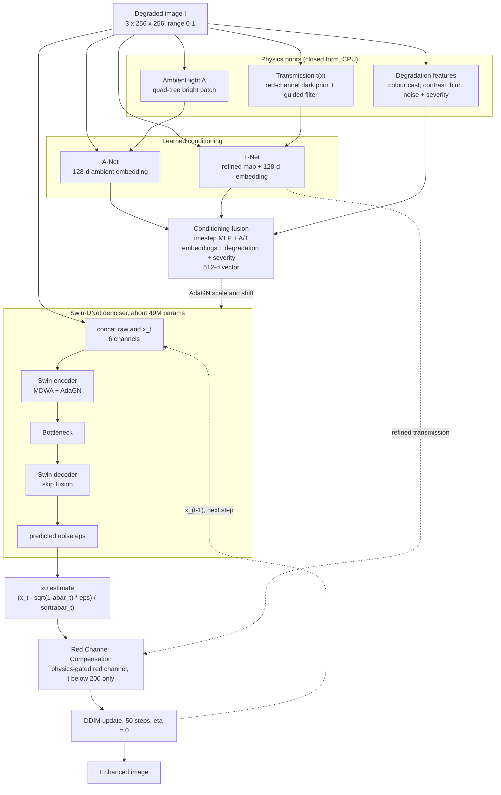

At **inference**, the conditioning is computed once and reused across all DDIM steps. Only the denoiser and the RCC hook run inside the sampling loop. At **training**, one random timestep is drawn per sample, noise is added to the clean reference, and the network predicts that noise.

### 3.2 Physics priors

All three priors are computed on the fly in the DataLoader workers (`src/data/physics_dataset.py`) from the `[0, 1]` image.

| Prior | File | Method | Output |
|---|---|---|---|
| **Ambient light A** | `src/physics/ambient.py` | Quad-tree search for the brightest region, robust (median-based) colour estimate from its brightest pixels, small blue-bias correction, clamp to 0.98 | `(3,)` |
| **Transmission t(x)** | `src/physics/transmission.py` | Divide by A, then a **red-channel** dark channel (15×15 patch) instead of the haze-style min over channels, because red is what water removes. `t̃ = 1 − ω·dark` with ω = 0.85, guided-filter refinement (radius 20), clamp to `[0.10, 1]` | `(1, H, W)` |
| **Degradation features** | `src/physics/degradation.py` | Per-channel colour-cast deviation (3), contrast (1), blur (1), noise (1), plus a weighted scalar **severity** ∈ [0, 1] (weights 0.30 / 0.25 / 0.25 / 0.20) | `(6,)` + `(1,)` |

### 3.3 Learned conditioning networks (A-Net & T-Net)

Both networks treat the physics estimate as a **hint to correct, not a ground truth to obey**: the estimate is concatenated to the input so the network can decide how far to trust it (`src/models/conditioning.py`).

- **A-Net** is a strided-conv + residual stem (`/8` resolution) → global average pool → concatenated with physics **A** → 2-layer MLP → **128-d ambient embedding**.
- **T-Net** is a three-scale UNet-style encoder–decoder over `[raw, physics t]` with two heads: a **refined spatial transmission map** `(B, 1, H, W)` (reused by RCC) and a **128-d transmission embedding** from mean+std pooling.

### 3.4 Swin-UNet denoiser with MDWA and AdaGN

`SwinUNetDenoiser` (`src/models/swin_unet.py`) predicts the noise ε.

| Property | Value |
|---|---|
| Input | `concat(raw, x_t)`, 6 channels, so the network has direct pixel access to the degraded image at every step |
| Patch embedding | patch size 4, base width `C = 96` |
| Stage depths | `[2, 2, 6, 2, 2, 6, 2]` (3 encoder stages, bottleneck, 3 decoder stages) |
| Heads per stage | `[3, 6, 12, 24, 12, 6, 3]` |
| Window size | 8 (MDWA also uses 4) |
| Down / up sampling | Patch-merge (×2 per stage) / patch-expand, decoder skip connections via conv-res fusion |
| Output | Full-resolution noise estimate `(B, 3, 256, 256)` |
| Total model | **50.70 M parameters** (denoiser + A/T-Net + RCC) |

**MDWA, Multi-scale Dynamic-Windowed Attention** (`attention.py`). The heads of each layer are split between two window scales: a large window (8×8) for broad structure and illumination trends, and a small window (4×4) for local texture. Each scale has its own relative-position bias with a learnable per-head gate (the "dynamic" part), and the outputs are concatenated and projected back to the layer width. This matters for underwater scenes, where turbidity and colour cast vary across the frame.

**AdaGN conditioning** (`adagn.py`). Every Swin block applies `y = scale · GroupNorm(x) + shift`, where `scale` and `shift` come from the 512-d conditioning vector. That vector fuses the sinusoidal timestep embedding with the A-Net/T-Net embeddings and the degradation/severity features (`embeddings.py`, `swin_unet.py`). This is how the network is told, at every layer, *when* in the diffusion chain it is, *what* the water looks like, and *how bad* the degradation is.

### 3.5 Red Channel Compensation (RCC)

RCC (`src/models/red_channel_compensation.py`) is the physics-based component that directly targets the red-channel loss. Inverting the formation model for the red channel gives a closed form:

```
J_r_phys(x) = ( I_r(x) − A_r · (1 − t_r(x)) ) / max( t_r(x), t_min )          t_min = 0.10
```

This is exact under the model but unstable where `t_r → 0` (noise amplification), so RCC never overwrites the network's own prediction. Instead it learns **where** to trust the physics:

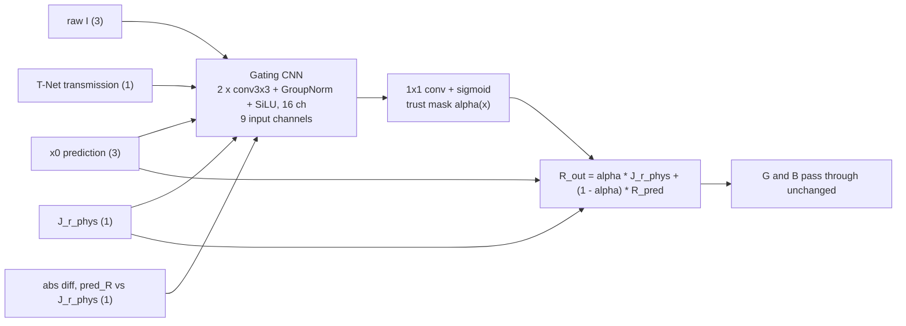

- The gate head is **zero-initialised with bias −2.0** (α ≈ 0.12), so RCC starts as a near-identity op and only learns to lean on the physics where the training signal supports it.
- It is tiny (a few thousand parameters) and uses GroupNorm, so there is no cross-sample batch contamination.
- It plugs into DDIM through an optional `x0_correction_fn` hook and is **applied only for t < 200** (see §7 for why).

### 3.6 Diffusion process and DDIM sampling

| | |
|---|---|
| Forward process | `q(x_t \| x_0) = N(√ᾱ_t · x_0, (1 − ᾱ_t) I)`, `T = 1000` |
| Noise schedule | **Cosine** (Nichol & Dhariwal), `s = 0.008` |
| Data range | `[0, 1]` with `clip_denoised = True` |
| Prediction target | ε (noise) |
| Sampler | Deterministic DDIM (η = 0), **50 steps**, starting from **t = T − 1 = 999** (ᾱ ≈ 9·10⁻⁵, essentially pure noise) |
| Weights at inference | EMA of the denoiser (decay 0.999) |

---

## 4. Training

### 4.1 Objective

Five losses are implemented (`src/losses/`). Three are active in the final recipe:

| Loss | Definition | Status |
|---|---|---|
| **Diffusion** | Min-SNR-γ weighted MSE between predicted and true noise (γ = 5) | ✅ active, all timesteps |
| **Perceptual** | VGG-16 L1 feature matching at `relu2_2 / relu3_3 / relu4_3`, weights `1.0 / 0.75 / 0.5` | ✅ active, **t < 200 only**, λ = 0.05 |
| **Histogram** | Differentiable soft-histogram CDF matching per RGB channel (256 bins, σ = 0.02) | ✅ active, **t < 200 only**, λ = 0.15 |
| Adversarial | PatchGAN discriminator | ⛔ implemented, disabled: destabilises training at this data scale |
| Contrastive | NT-Xent, positive = reference, negative = raw | ⛔ implemented, disabled |

### 4.2 Why the image-space losses are gated

Perceptual and histogram losses compare an **x̂₀ estimate** with the reference. At high timesteps x̂₀ is dominated by noise: with `x̂₀ = (x_t − √(1−ᾱ_t) ε̂)/√ᾱ_t`, the `1/√ᾱ_t` factor amplifies any ε̂ error by more than **20,000×** at t = 999, versus about **1.05×** at t = 200. Applied everywhere, these losses generated huge, meaningless gradients that the denoiser "solved" by outputting ε̂ ≈ 0, which is a noise-prediction collapse (std of ε̂ falling to ~0.1, and inference producing pure noise). Gating them to `t < 200` restores a healthy ε̂ (std → ~1.0).

### 4.3 Training recipe

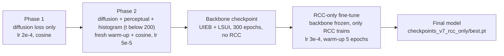

| Setting | Value |
|---|---|
| Optimiser | AdamW (β = 0.9 / 0.999, weight decay 1e-2) |
| Gradient clipping | 0.5 |
| Precision | bfloat16 AMP, `torch.compile` |
| EMA | decay 0.999, applied to the denoiser |
| Phase-2 schedule | Its own warm-up + cosine from `lr_phase2 = 5e-5`, with Adam state reset by default |
| RCC-only schedule | `lr_rcc_only = 3e-4`, 5 warm-up epochs, `cond_nets` and `denoiser` frozen |
| Augmentation | Horizontal flip, ±15° rotation, light colour jitter (identity normalisation, so data stays in `[0, 1]`) |
| Hardware | 1× RTX 4090 (24 GB), shared server |

**Why RCC is trained with the backbone frozen.** Fine-tuning RCC jointly with the converged backbone caused catastrophic forgetting (PSNR 18.26 → 12.57 dB within 20 epochs, SSIM 0.779 → 0.388), and the collapse reproduced with RCC switched off at evaluation, which pinned the blame on the shared denoiser rather than on RCC. Freezing `cond_nets` and `denoiser` makes that failure structurally impossible. Only RCC's own parameters can move. Because RCC's output never enters the diffusion loss, it can only receive gradient from the perceptual/histogram terms. A "diffusion-only" RCC run would give it exactly zero gradient.

---

## 5. Data and evaluation protocol

| Dataset | Pairs | Use |
|---|---|---|
| **UIEB** | 890 paired (raw / reference), resized to 256×256 | Train / val / test split **70 / 15 / 15 → 623 / 133 / 134**, fixed seed 42 |
| **LSUI** | 4,279 paired, variable native resolution → resized to 256×256 | **Appended to the training split only** |

- The **134-image UIEB test split is the fixed thesis benchmark.** It is never used for training or checkpoint selection, and every reported number in this repository comes from it.
- **Leakage check.** A perceptual-hash comparison of all 134 UIEB test images against all 8,558 LSUI images (inputs and references) found **zero overlap**, so combining the datasets is safe.
- **Metrics.**
  - *Full-reference:* **PSNR**, **SSIM**, **LPIPS** against the UIEB reference.
  - *No-reference:* **UIQM** (colourfulness, sharpness, contrast) and **UCIQE** (chroma variance, luminance contrast, saturation in CIELab). UCIQE here is **not** normalised to [0, 1]; typical values are 10–40, so it is only meaningful as a relative comparison against the input or other runs.
- **Honest evaluation.** Metrics are computed on the clean `[0, 1]` output with no post-processing or ImageNet de-normalisation. A previous evaluation path wrongly de-normalised already-`[0, 1]` data and reported ~30 dB PSNR, which was invalid and has been discarded (§7).

---

## 6. Results

### 6.1 Quantitative results

Final model: `checkpoints_v7_rcc_only/best.pt` · 50.70 M parameters · DDIM 50 steps · RCC enabled · UIEB test split (134 images, 256×256). Mean ± std over the test set.

| Metric | Input (degraded) | **P-UWDM (ours)** | Δ | Images improved |
|---|:---:|:---:|:---:|:---:|
| PSNR (dB) ↑ | 16.99 | **18.30** ± 3.65 | +1.31 | 67.9 % |
| SSIM ↑ | 0.7575 | **0.7952** ± 0.124 | +0.038 | 57.5 % |
| LPIPS ↓ | 0.2168 | 0.2445 ± 0.127 | +0.028 | 48.5 % |
| UCIQE ↑ | 21.473 | **23.591** ± 3.61 | +2.118 | 59.7 % |
| UIQM ↑ | 5.351 | **7.979** ± 2.53 | +2.628 | **92.5 %** |


**Against the thesis targets.** The target was PSNR > 22 dB and SSIM > 0.85. The model reaches 18.30 dB / 0.795 on average. Individually, 16 of 134 images exceed 22 dB, 55 exceed SSIM 0.85, and 15 satisfy both.

### 6.2 Best test images

<p align="center">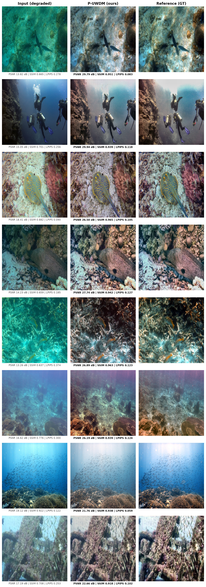</p>
<p align="center"><sub>The eight highest-scoring test images (selected by a combined score over the metrics, so this is a best-case showcase, not a representative one).</sub></p>

<details>
<summary><b>Individual comparisons (input · output · reference)</b></summary>

| # | idx | Comparison |
|:-:|:-:|---|
| 1 | 74 |  |
| 2 | 95 |  |
| 3 | 93 |  |
| 4 | 114 | 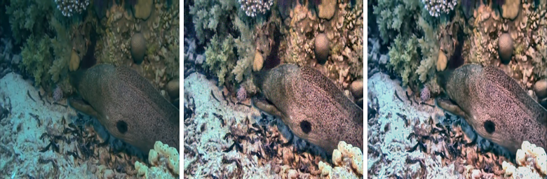 |
| 5 | 30 | 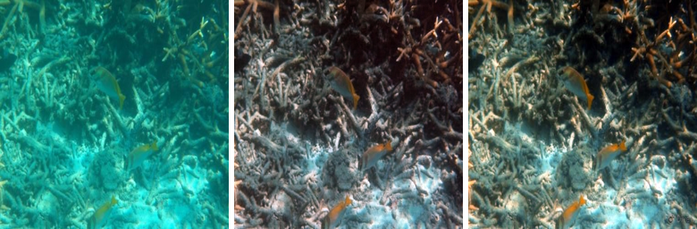 |
| 6 | 82 | 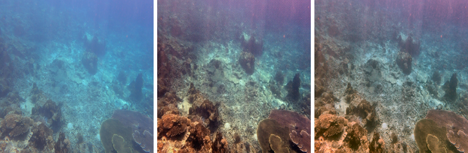 |
| 7 | 9 | 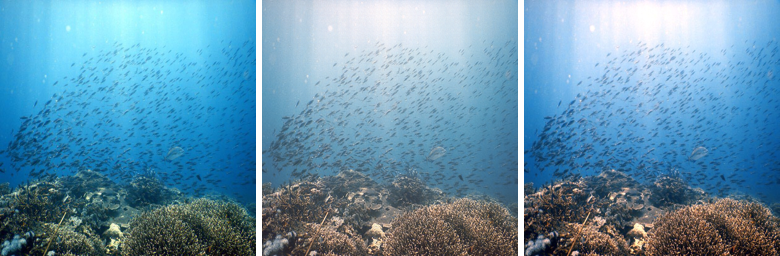 |
| 8 | 71 | 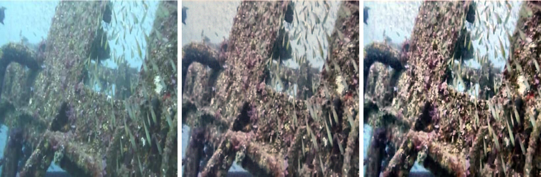 |

</details>

### 6.3 Unselected samples (not cherry-picked)

<p align="center">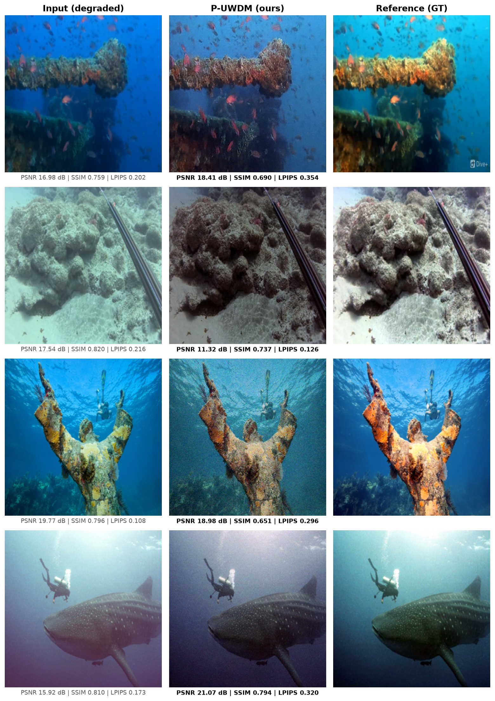</p>
<p align="center"><sub>Four randomly drawn test images (idx 3, 15, 86, 101). They are included deliberately so that failure modes are visible.</sub></p>

These show the typical spread: row 1 recovers colour but stays cooler and flatter than the reference; row 2 (idx 15, the worst-PSNR image in the test set) over-darkens a bright scene; row 3 recolours the statue well but adds visible high-frequency grain; row 4 shifts hue toward purple.

### 6.4 Metric distributions

<p align="center">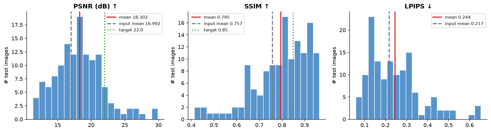</p>
<p align="center"><sub>Per-image distributions over the 134 test images. Red = model mean, grey dashed = input mean, green dotted = thesis target.</sub></p>

### 6.5 What the per-image data says

- **Largest gains on the worst inputs.** On the 63 test images whose *input* PSNR is below 16 dB, the mean PSNR gain is **+4.63 dB**. 38 % of all images gain more than 3 dB.
- **Already-good inputs get worse.** On the 27 images whose input PSNR is ≥ 20 dB, the mean change is **−5.05 dB**. The model tends to apply a strong correction even when little is needed. Part of this is expected statistical behaviour (high-PSNR inputs have little room to improve), but the magnitude suggests over-correction. This is the model's main weakness.
- **Colour / contrast improve far more reliably than pixel fidelity.** UIQM improves on 92.5 % of images, but PSNR on 68 %, SSIM on 58 %, and LPIPS on only 48.5 %.
- **A heavy tail of failures.** The worst SSIM values (idx 90, 39, 46, 7, 62, 81 all below 0.51) and the worst PSNR values (idx 15, 90, 20, 43 all ≈ 11–12 dB) include several images whose input was already close to the reference (e.g. idx 20: 25.9 dB in, 11.9 dB out). The suspected cause is over-saturation or wrong-direction colour correction, but this has not been verified image by image.
- **Reference metrics and no-reference metrics can disagree.** The test image with the highest UCIQE (idx 133, 36.2) has an SSIM of only 0.53, among the lowest in the set, so a high no-reference score on its own is not evidence of a faithful restoration.
- **UIEB references are not absolute ground truth.** They are themselves the best output among several enhancement algorithms, so PSNR/SSIM/LPIPS against them under-credit valid but different colour renditions.

### 6.6 Development progression

How the checkpoints evolved, evaluated on the same fixed 134-image UIEB split. These rows are drawn from the project's training and evaluation logs and code comments. Only the last row is backed by the files in [`assets/`](assets/).

| Stage | Change | PSNR | SSIM | Other |
|---|---|:---:|:---:|---|
| Phase 1 only | Diffusion loss only | 15.86 | 0.745 | LPIPS 0.302, UCIQE 16.89 |
| Phase 2 + histogram | + perceptual and histogram (gated, t < 200) | 18.74 | 0.830 | LPIPS 0.203, UCIQE 22.79 |
| Best UIEB-only checkpoint | Phase 3, histogram loss, epoch 150 | **19.47** | **0.845** | LPIPS 0.188, UCIQE 24.02, UIQM 7.44 |
| Backbone + LSUI | UIEB + LSUI, 300 epochs, no RCC | 18.55 | 0.796 | Base for RCC fine-tuning |
| **Final (shown above)** | + RCC, backbone frozen, RCC-only fine-tune | 18.30 | 0.795 | UIQM 7.98, UCIQE 23.59 |

Two observations worth stating plainly: (1) the UIEB-only epoch-150 checkpoint scores higher on reference metrics than the LSUI-pretrained + RCC model, so adding LSUI and RCC did not improve reference-based scores in this study; (2) RCC-only fine-tuning landed within 0.25 dB / 0.001 SSIM of its own base, so **its isolated contribution is not established by these experiments**. A clean RCC on/off ablation on the same backbone, with no-reference metrics, is listed under future work.

---

## 7. Findings and lessons learned

The practical findings from building and debugging this model. Several of these are failure modes that are easy to hit when training a diffusion model on a small paired dataset.

| # | Finding | Evidence / consequence |
|---|---|---|
| 1 | **Image-space losses must be timestep-gated.** Perceptual/histogram losses on x̂₀ at all timesteps collapse noise prediction. | ε̂ std fell to ~0.1 and sampling produced noise. Gating to `t < 200` fixed it (§4.2). |
| 2 | **DDIM must start from t = T − 1.** An earlier version capped the start at t ≈ 934 (ᾱ ≈ 0.01), which is mid-chain noise, not the prior. | At t = 934, x̂₀ is amplified 10× before clamping, so every early step was garbage. Starting from 999 produced coherent sampling. |
| 3 | **RCC must only act at low t.** Applying it at all 50 DDIM steps feeds a physics-computed red channel into what is still noise, corrupting the trajectory. | Catastrophic regression to 14.10 dB / 0.596 vs a 19.47 dB / 0.845 baseline. The `t < 200` gate in `PUWDM.sample()` restores the training distribution. |
| 4 | **Joint fine-tuning of a converged backbone forgets.** Starting a new phase with a fresh optimiser at the Phase-1 learning rate wiped out prior progress. | PSNR 18.26 → 12.57 dB and SSIM 0.779 → 0.388 within 20 epochs, which motivated the frozen-backbone RCC-only recipe and the "safe Phase-2" default for weight-only initialisation. |
| 5 | **Adam state reset matters.** Resetting moment estimates on a converged checkpoint causes oversized early steps that can permanently displace the model. | Use a very low LR (≤ 5e-6) with ≥ 15 warm-up epochs, or keep the optimiser state. |
| 6 | **Validation diffusion loss is a poor checkpoint selector** once image-space losses are active. | `epoch_0150.pt` beat `best.pt` despite a worse validation diffusion loss. Always evaluate several checkpoints with the full metric suite. |
| 7 | **Metric hygiene.** Re-applying ImageNet de-normalisation to data already in `[0, 1]` inflated PSNR to ~30 dB. | Those numbers are scientifically invalid (washed-out visuals, worse UIQM/UCIQE). All reported numbers use the clean `[0, 1]` path. |
| 8 | **Latent data-pipeline bugs.** The dataset's `imagenet_normalised` default silently corrupted the physics priors for early runs, and augmentation defined in the YAML was never wired in. | Both fixed. The physics-prior input range is now explicit, and augmentation is applied with identity normalisation. |
| 9 | **Adversarial loss is not worth it at 890 images.** | Disabled; the implementation is kept for completeness. |
| 10 | **Engineering hygiene on shared hardware.** `torch.save` can silently corrupt a checkpoint when the disk is full. | Verify checkpoint file size before resuming, and check free VRAM/disk before launching. |

---

## 8. Limitations and future work

**Limitations**

- Targets not met: PSNR 18.30 dB (target > 22) and SSIM 0.795 (target > 0.85) on the fixed benchmark.
- LPIPS is slightly worse than the raw input on average, and the model over-corrects already-good images.
- No head-to-head comparison against published baselines (e.g. UWCNN, FUnIE-GAN, Water-Net, DiffWater) has been run, so no claim of state-of-the-art is made.
- The isolated benefit of RCC is unproven (§6.6): no RCC on/off ablation on a shared backbone with no-reference metrics yet.
- Single-resolution (256×256) and a single benchmark split. Cross-dataset generalisation (e.g. to EUVP or the 60 unreferenced UIEB "challenging" images) is untested.
- The degradation estimator is a hand-crafted physics feature extractor only. The proposal's learned second stream was not implemented.
- Reported inference timing is CPU-based and includes metric computation.

**Future work**

1. Run the missing ablations (RCC on/off, A-Net/T-Net on/off, MDWA vs single-scale windows, AdaGN severity conditioning) under identical training budgets.
2. Add an identity-preserving regulariser or severity-aware loss re-weighting to stop over-correction of mildly degraded inputs, then re-inspect the failure cases (idx 22, 133, 20, 63, 10).
3. Benchmark against published methods on UIEB and cross-dataset (LSUI, EUVP, unreferenced challenging set) and report parameters / latency on GPU.
4. Evaluate downstream effect (e.g. detection or segmentation on enhanced images).
5. Explore latent-space diffusion or fewer-step samplers for real-time deployment.

---

## 9. Deviations from the thesis proposal

The implementation evolved from the March 2026 proposal. For transparency:

| Aspect | Proposal | Implementation |
|---|---|---|
| Split of UIEB | 80 / 10 / 10 | 70 / 15 / 15 (623 / 133 / 134) |
| Beta schedule | Linear (1e-6 to 1e-2) | Cosine, `s = 0.008` |
| Data range | `[−1, 1]` | `[0, 1]` with `clip_denoised` |
| Optimiser LR | Adam, 1e-4 | AdamW, 2e-4 (phase 1) → 5e-5 (phase 2) → 3e-4 (RCC-only) |
| Losses | Diffusion + adversarial + perceptual + histogram + contrastive | Diffusion + perceptual + histogram (adversarial / contrastive implemented but disabled) |
| Histogram loss | KL divergence | Soft-histogram CDF L1 distance |
| Degradation estimator | Dual-stream, score from input PSNR | Physics-feature stream only (6-d features + severity) |
| RCC | Learnable module in the decoder path | Post-decoder x̂₀ correction with Beer-Lambert physics + learned gate, t < 200 only |
| Datasets | UIEB + LSUI + EUVP | UIEB + LSUI (EUVP not used) |
| Warm-up | 20 epochs diffusion-only | 80-epoch diffusion-only phase 1 in the default schedule |

---

## 10. Repository structure

```
.
├── train.py                          # Training entry point (fresh / resume / weights-only / RCC-only)
├── configs/
│   └── data_config.yaml              # Splits, loader, augmentation settings
├── src/
│   ├── data/
│   │   ├── splitter.py               # Deterministic train/val/test split + manifest
│   │   ├── dataset.py, transforms.py # Base paired dataset and augmentation
│   │   ├── physics_dataset.py        # UIEB(+LSUI) dataset with on-the-fly A, t, degradation priors
│   │   └── datamodule.py
│   ├── physics/
│   │   ├── ambient.py                # Ambient light estimation
│   │   ├── transmission.py           # Red-channel dark-prior transmission + guided filter
│   │   └── degradation.py            # Degradation features and severity
│   ├── models/
│   │   ├── p_uwdm.py                 # Top-level model: training step, DDIM sampling, EMA
│   │   ├── conditioning.py           # A-Net and T-Net
│   │   ├── swin_unet.py              # Swin-UNet denoiser
│   │   ├── attention.py              # MDWA
│   │   ├── adagn.py, embeddings.py   # AdaGN and conditioning fusion
│   │   ├── blocks.py                 # Patch embed/merge/expand, Swin stages
│   │   ├── diffusion.py              # Cosine schedule, forward process, DDIM sampler
│   │   ├── red_channel_compensation.py
│   │   └── discriminator.py          # PatchGAN (disabled in final recipe)
│   ├── losses/
│   │   ├── composite.py              # Phase presets, timestep gating (LOW_T_THRESHOLD = 200)
│   │   ├── diffusion.py, perceptual.py, histogram.py
│   │   └── adversarial.py, contrastive.py
│   ├── training/trainer.py           # Two-phase trainer, EMA, RCC-only mode, checkpointing
│   └── utils/                        # Config and logging helpers
└── assets/                           # Results: figures, per-image CSV, summary JSON
    ├── showcase_best.png, showcase_random.png, metric_distributions.png
    ├── best/                         # Per-image input / enhanced / reference + comparison strips
    ├── metrics_summary.json
    ├── metrics_per_image.csv
    └── results.md
```

---

## 11. Authors, citation, references

**Authors:** Md. Nurun Noby · Md. Hasibul Hasan
**Supervisor:** Dr. Md. Rokanujjaman, Professor, CSE, University of Rajshahi
**Co-supervisor:** Dr. Abu Saleh Musa Miah, Lecturer, CSE, University of Rajshahi

```bibtex
@thesis{puwdm2026,
  title  = {Conditional Pixel-Space Diffusion Models for Underwater Image Enhancement},
  author = {Noby, Md. Nurun and Hasan, Md. Hasibul},
  school = {University of Rajshahi},
  type   = {B.Sc. Thesis},
  year   = {2026}
}
```

### References

1. J. Ho, A. Jain, P. Abbeel. *Denoising Diffusion Probabilistic Models.* NeurIPS 2020.
2. J. Song, C. Meng, S. Ermon. *Denoising Diffusion Implicit Models.* ICLR 2021.
3. A. Nichol, P. Dhariwal. *Improved Denoising Diffusion Probabilistic Models.* ICML 2021 (cosine schedule).
4. P. Dhariwal, A. Nichol. *Diffusion Models Beat GANs on Image Synthesis.* NeurIPS 2021 (AdaGN).
5. T. Hang et al. *Efficient Diffusion Training via Min-SNR Weighting Strategy.* ICCV 2023.
6. Z. Liu et al. *Swin Transformer.* ICCV 2021. · H. Cao et al. *Swin-Unet.* ECCVW 2022.
7. K. He, J. Sun, X. Tang. *Single Image Haze Removal Using Dark Channel Prior.* TPAMI 2011.
8. J. Y. Chiang, Y.-C. Chen. *Underwater Image Enhancement by Wavelength Compensation and Dehazing.* TIP 2012.
9. A. Galdran et al. *Automatic Red-Channel Underwater Image Restoration.* JVCIR 2015.
10. C. Li et al. *An Underwater Image Enhancement Benchmark Dataset and Beyond (UIEB).* TIP 2020.
11. L. Peng, C. Zhu, L. Bian. *U-shape Transformer for Underwater Image Enhancement (LSUI).* TIP 2023.
12. M. Guan et al. *DiffWater: Underwater Image Enhancement Based on Conditional DDPM.* JSTARS 2024.
13. J. Cao et al. *DACA-Net: A Degradation-Aware Conditional Diffusion Network for Underwater Image Enhancement.* arXiv:2507.22501, 2025.
14. Y. Fang, Q. Li, K. Wang. *Multi-scale Diffusion Model for Underwater Image Restoration and Enhancement.* PLoS One 2025.
15. X. Ding et al. *Underwater Image Enhancement Using a Diffusion Model with Adversarial Learning.* J. Imaging 2025.
16. N. G. Bach et al. *Underwater Image Enhancement with Physical-based Denoising Diffusion Implicit Models.* Shibaura Institute of Technology, 2024.
17. K. Panetta, C. Gao, S. Agaian. *Human-Visual-System-Inspired Underwater Image Quality Measures (UIQM).* IEEE J. Oceanic Eng. 2016. · M. Yang, A. Sowmya. *An Underwater Color Image Quality Evaluation Metric (UCIQE).* TIP 2015.
18. R. Zhang et al. *The Unreasonable Effectiveness of Deep Features as a Perceptual Metric (LPIPS).* CVPR 2018.

---

<div align="center">
<sub>Department of Computer Science and Engineering · University of Rajshahi · Rajshahi, Bangladesh</sub>
</div>
